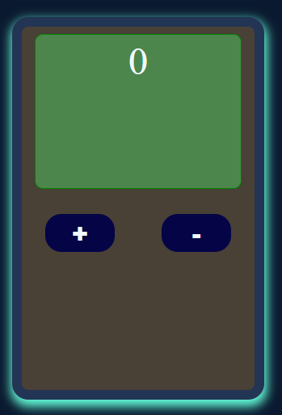
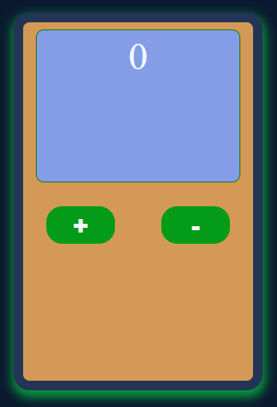
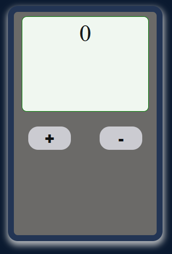

# counterJavascript

Counter made in Javascript/Html/CSS

<h1 align="left">Hi 👋! My name is Davide from &#x1f1ee;&#x1f1f9;🍕&#127837;🛵</h1>
<h2>Here you can try a very very <s>very</s> <s>very</s> simple counter made entirely in javascript.</h2>

###

I created a simple JavaScript application that allows the user to increase or decrease the value of a counter using two buttons, + and −.

The operation is simple:

- When the user accesses the page, he must press the "Iniziamo" button to generate the counter.
- A control will allow only one counter to be generated.
- You can increase or decrease the value infinitely (or until your mouse breaks😆).
- Below the counter I placed three buttons to set three different colors.

###

Try it: <a href="https://github.com/demasidavide/counterJavascript/tree/main">HERE</a>

###

<h3>Have fun!</h3>

###
<h3>Some of the languages ​​I use the most:</h3>

   

###

  
  
  
  
  
  
  
  
  
  
  
  
  
  
  
  
  

###

  
  
  

###

